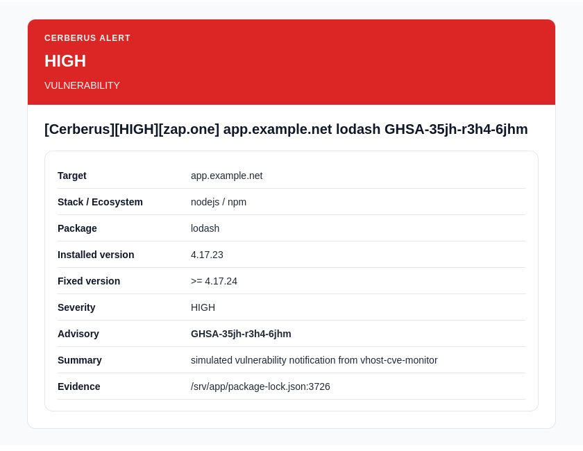
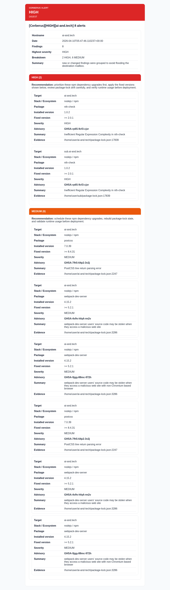

# Cerberus

[](https://opensource.org/licenses/MIT)
[](https://www.python.org/)
[](https://www.debian.org/)
[](https://github.com/Zappan-net/cerberus/releases)
[](https://github.com/Zappan-net/cerberus/commits/main)

Cerberus is a maintainable Python 3 monitor for Debian servers that inspects nginx vhosts, detects the application stack behind each vhost, runs stack-specific security audits when possible, correlates detected versions with a local SQLite advisory cache, and sends email alerts only for new or materially changed findings.

## Table of Contents

- [Features](#features)
- [Architecture](#architecture)
- [Installation](#installation)
- [Configuration](#configuration)
- [Usage](#usage)
- [Notification Examples](#notification-examples)
- [Known Limits](#known-limits)
- [Improvement Plan](#improvement-plan)

## Features

- built for classic Debian hosts with multiple nginx vhosts and mixed stacks
- keeps a local SQLite advisory cache and still works in offline scans against cached data
- sends readable HTML alerts with severity grouping, fixed versions, and concise remediation hints



License: MIT. See [LICENSE](LICENSE).
Author: Julien Wehrbach.

Detailed internal documentation is available in [docs/CODE_BREAKDOWN.md](docs/CODE_BREAKDOWN.md).
Architecture diagrams are available in [docs/DIAGRAMS.md](docs/DIAGRAMS.md).
An editable office export source is available in [docs/README_EXPORT.md](docs/README_EXPORT.md).

## Architecture

The project is split into explicit layers:

1. `nginx_parser.py`
   Reads files from `/etc/nginx/sites-enabled`, resolves useful `include` directives, and extracts `server_name`, `root`, `proxy_pass`, `fastcgi_pass`, `uwsgi_pass`, and upstream/socket paths.
2. `stack_detection.py`
   Applies readable heuristics on filesystem markers and upstream names. The logic is intentionally explicit, not opaque.
3. `collectors.py`
   Collects dependency versions from common manifests and environments:
   `composer.lock`, `composer.json`, `package-lock.json`, `npm-shrinkwrap.json`, `package.json`, `requirements.txt`, `poetry.lock`, `.venv/bin/python`, `venv/bin/python`, `gitea --version`, and `VERSION`.
4. `audits.py`
   Runs `npm audit`, `composer audit`, and `pip-audit` when available, under a timeout. If a tool is missing or the project is incomplete, Cerberus keeps going and falls back to the local advisory cache.
5. `cve_db.py`
   Maintains a local SQLite advisory cache. The chosen strategy is pragmatic: Cerberus does not mirror all CVEs, it normalizes and caches OSV responses only for the package/version pairs it actually sees. This keeps the local database small and useful on a simple Debian host. Between refreshes, scans can run in offline mode against the cache.
6. `state_store.py`
   Stores alert fingerprints and repeated failure counters to avoid duplicate emails.
7. `notify.py`
   Sends mail through local `sendmail`, plain SMTP, STARTTLS SMTP, or authenticated SMTPS/SMTP.
8. `scanner.py`
   Orchestrates one full scan, cache refresh, deduplicated notification generation, and the optional internal daemon loop.

## Technical choices

- Python 3 standard library first, plus `PyYAML` for configuration parsing.
- `systemd timer` preferred over an infinite daemon loop. It is simpler, more observable, and more resilient on Debian. An internal `daemon` mode is still provided for environments that want it.
- SQLite for both state and advisory cache, to avoid extra services.
- Local CVE strategy: OSV targeted synchronization plus SQLite normalization.
  Hypothesis: internet access is available during periodic syncs. If not, Cerberus still works against the last cached data.
- External audit tools are optional, not required for the process to continue.
- All variable names, function names, and comments are in English.

## Final tree

```text
.
├── pyproject.toml
├── README.md
├── packaging
│   ├── examples
│   │   ├── config.yml
│   │   ├── sample-email.txt
│   │   └── sample-log.txt
│   ├── scripts
│   │   ├── install.sh
│   │   └── testmail
│   └── systemd
│       ├── vhost-cve-monitor.service
│       ├── vhost-cve-monitor.timer
│       ├── vhost-cve-monitor-cve-sync.service
│       └── vhost-cve-monitor-cve-sync.timer
├── src
│   └── vhost_cve_monitor
│       ├── __init__.py
│       ├── audits.py
│       ├── cli.py
│       ├── collectors.py
│       ├── config.py
│       ├── cve_db.py
│       ├── logging_utils.py
│       ├── models.py
│       ├── nginx_parser.py
│       ├── notify.py
│       ├── scanner.py
│       ├── stack_detection.py
│       ├── state_store.py
│       └── subprocess_utils.py
└── tests
    ├── test_cli.py
    ├── test_collectors.py
    ├── test_nginx_parser.py
    ├── test_scanner_digest.py
    ├── test_scanner_test_mail.py
    ├── test_stack_detection.py
    └── test_state_store.py
```

## Installation

### Dependencies

- Python 3.7+
- `python3-venv`
- `python3-yaml`
- a local MTA exposing `/usr/sbin/sendmail` if you use the default example config
- Optional but recommended:
  - `npm`
  - `composer`
  - `pip-audit`

### Install

Cerberus now installs into a dedicated virtual environment under `/opt/cerberus/.venv`. Debian marks the system Python as externally managed (PEP 668), so Cerberus no longer relies on `python3 -m pip install .` into the global interpreter.

Admin-facing wrappers are exposed in `/usr/local/bin/`:

- `/usr/local/bin/vhost-cve-monitor`
- `/usr/local/bin/vhost-cve-monitor-testmail`

Two installation paths are supported:

- direct local install with the helper script
- Debian package build/install, which still uses `/opt/cerberus/.venv` at runtime

```bash
cd /opt/cerberus
sudo sh packaging/scripts/install.sh
```

The helper is idempotent:

- it creates `/opt/cerberus/.venv` if needed
- it refreshes the package in that venv on rerun
- it refreshes `/usr/local/bin/` wrappers on rerun
- it installs a default `/etc/vhost-cve-monitor/config.yml` only if none exists yet
- it does not overwrite an existing live config

### Build a Debian package

Cerberus can also be packaged as a simple `.deb` while keeping the dedicated runtime venv model.

```bash
cd /opt/cerberus
dpkg-buildpackage -us -uc
```

Then install the generated package from the parent directory:

```bash
sudo dpkg -i ../cerberus_0.1.0-1_all.deb
```

The package installs:

- the project files under `/opt/cerberus`
- systemd units under `/lib/systemd/system`
- runtime wrappers in `/usr/local/bin`
- the packaged example config under `/usr/share/cerberus/config.yml`

Its `postinst` script then:

- creates or reuses `/opt/cerberus/.venv`
- creates that venv with `--system-site-packages`
- installs or refreshes Cerberus inside that venv without downloading Python dependencies at package-install time
- installs `/etc/vhost-cve-monitor/config.yml` from `/usr/share/cerberus/config.yml` only if no live config exists yet
- enables the timers

### Upgrade existing installations

If Cerberus is already installed on the machine, update it from the repository root:

```bash
cd /opt/cerberus
sudo sh packaging/scripts/install.sh
```

If you installed Cerberus from the Debian package, rebuild and reinstall the `.deb` instead of calling global `pip`:

```bash
cd /opt/cerberus
dpkg-buildpackage -us -uc
sudo dpkg -i ../cerberus_0.1.0-1_all.deb
```

If you changed packaged files such as systemd units, reload systemd and ensure the timers are enabled:

```bash
sudo systemctl daemon-reload
sudo systemctl enable --now vhost-cve-monitor.timer
sudo systemctl enable --now vhost-cve-monitor-cve-sync.timer
```

If the timers were already active, `daemon-reload` is usually enough unless the unit files changed structurally. If you want to force an immediate run, restart the associated `.service` unit instead of the `.timer`.

If you changed mail authentication or local MTA integration, also reload the relevant services:

```bash
sudo systemctl restart opendkim
sudo systemctl reload postfix
```

Recommended post-upgrade checks:

```bash
vhost-cve-monitor --config /etc/vhost-cve-monitor/config.yml --dry-run scan-once
vhost-cve-monitor-testmail HIGH
```

## Configuration

Example file: [packaging/examples/config.yml](packaging/examples/config.yml)

Configuration split:

- repository default example: [packaging/examples/config.yml](packaging/examples/config.yml)
- live machine configuration: `/etc/vhost-cve-monitor/config.yml`

The repository file is intentionally generic and safe to publish. The `/etc` file is the local deployment configuration and may contain real recipients, sender domains, and environment-specific tuning.

The default example config assumes a simple local Postfix/sendmail setup with:

- `notifications.method: sendmail`
- `notifications.email_to: [root@localhost]`
- `notifications.email_from: cerberus@localhost`

If you keep that example unchanged, ensure a local MTA provides `/usr/sbin/sendmail`.
If `sendmail` is missing, Cerberus now returns a concise delivery error instead of a full Python traceback.

Main keys:

- `nginx.sites_enabled_dir`: nginx vhost directory to scan.
- `scanner.default_roots`: fallback roots to inspect if nginx `root` is absent or incomplete.
- `scanner.command_timeout_seconds`: timeout for `npm audit`, `composer audit`, `pip-audit`, and `pip freeze`.
- `scanner.repeated_failure_threshold`: number of identical failures before an alert is sent.
- `notifications.method`: `sendmail` or `smtp`.
- `notifications.smtp_host` / `notifications.smtp_port`: SMTP relay endpoint used when `method: smtp`.
- `notifications.smtp_ssl`: enable implicit TLS (`SMTP_SSL`), typically for port 465.
- `notifications.smtp_starttls`: upgrade a plain SMTP session with STARTTLS, typically for port 587.
- `notifications.smtp_username`: SMTP account name for authenticated relays.
- `notifications.smtp_password`: SMTP password if you choose to store it in YAML.
- `notifications.smtp_password_env`: environment variable name holding the SMTP password; preferred over inline secrets.
- `notifications.max_emails_per_run`: hard cap per scan cycle, with overflow grouped into one digest mail.
- `notifications.summary_only`: when enabled, one scan generates one single summary mail containing every alert from that run.
- digest mails keep the differential-alerting model, group retained findings by severity, and render advisory summaries when upstream data provides them.
- `filters.*`: allowlist/blocklist for vhosts and paths.

Authenticated SMTP examples:

```yaml
notifications:
  method: smtp
  smtp_host: smtp.example.net
  smtp_port: 587
  smtp_ssl: false
  smtp_starttls: true
  smtp_username: cerberus@example.net
  smtp_password_env: CERBERUS_SMTP_PASSWORD
```

```yaml
notifications:
  method: smtp
  smtp_host: smtp.example.net
  smtp_port: 465
  smtp_ssl: true
  smtp_starttls: false
  smtp_username: cerberus@example.net
  smtp_password_env: CERBERUS_SMTP_PASSWORD
```

Do not enable both `smtp_ssl` and `smtp_starttls` at the same time.

## Usage

Single scan:

```bash
vhost-cve-monitor --config /etc/vhost-cve-monitor/config.yml scan-once
```

Directly from the venv:

```bash
/opt/cerberus/.venv/bin/vhost-cve-monitor --config /etc/vhost-cve-monitor/config.yml scan-once
```

Dry run:

```bash
vhost-cve-monitor --config /etc/vhost-cve-monitor/config.yml --dry-run scan-once
```

Verbose dry run:

```bash
vhost-cve-monitor --verbose --config /etc/vhost-cve-monitor/config.yml --dry-run scan-once
```

Offline scan against cached data only:

```bash
vhost-cve-monitor --config /etc/vhost-cve-monitor/config.yml --offline scan-once
```

Focused scan for one vhost or pattern:

```bash
vhost-cve-monitor --config /etc/vhost-cve-monitor/config.yml scan-once --only-vhost app.example.net
vhost-cve-monitor --config /etc/vhost-cve-monitor/config.yml scan-once --only-vhost "admin.*"
```

Validate the loaded configuration:

```bash
vhost-cve-monitor --config /etc/vhost-cve-monitor/config.yml validate-config
```

Run an environment and runtime diagnostic pass:

```bash
vhost-cve-monitor --config /etc/vhost-cve-monitor/config.yml doctor
```

List parsed nginx vhosts with filter and stack context:

```bash
vhost-cve-monitor --config /etc/vhost-cve-monitor/config.yml list-vhosts
```

Explain one vhost in detail:

```bash
vhost-cve-monitor --config /etc/vhost-cve-monitor/config.yml explain-vhost app.example.net
```

Manual CVE cache refresh:

```bash
vhost-cve-monitor --config /etc/vhost-cve-monitor/config.yml sync-cve
```

Export the latest materialized findings snapshot as JSON:

```bash
vhost-cve-monitor --config /etc/vhost-cve-monitor/config.yml export-findings
```

Write that export directly to a file for a third-party consumer:

```bash
vhost-cve-monitor --config /etc/vhost-cve-monitor/config.yml export-findings --output /var/lib/cerberus/findings.json
```

This snapshot is refreshed automatically at the end of each `scan-once` run, so the regular systemd timer keeps it up to date for third-party consumers without adding a local web service. If no snapshot exists yet, `export-findings` performs a collection-only pass to initialize it without sending notifications.

Test mail:

```bash
vhost-cve-monitor --config /etc/vhost-cve-monitor/config.yml test-mail
```

Test mail with explicit severity:

```bash
vhost-cve-monitor --config /etc/vhost-cve-monitor/config.yml test-mail --severity HIGH
```

Admin-friendly wrapper:

```bash
vhost-cve-monitor-testmail HIGH
vhost-cve-monitor-testmail LOW MEDIUM HIGH
```

Test mail with explicit severity and category:

```bash
vhost-cve-monitor --config /etc/vhost-cve-monitor/config.yml test-mail --severity CRITICAL --category vulnerability
vhost-cve-monitor --config /etc/vhost-cve-monitor/config.yml test-mail --severity WARNING --category scan-failure
vhost-cve-monitor --config /etc/vhost-cve-monitor/config.yml test-mail --severity HIGH --category internal-error
vhost-cve-monitor --config /etc/vhost-cve-monitor/config.yml test-mail --severity MEDIUM --category digest
```

Stack-aware vulnerability simulation:

```bash
vhost-cve-monitor --config /etc/vhost-cve-monitor/config.yml test-mail \
  --category vulnerability \
  --severity HIGH \
  --stack nodejs \
  --package lodash \
  --installed-version 4.17.23 \
  --fixed-version ">= 4.17.24" \
  --advisory-id GHSA-35jh-r3h4-6jhm \
  --vhost app.example.net \
  --source-file /srv/app/package-lock.json \
  --source-line 3726
```

Supported `test-mail` categories:

- `test`
- `vulnerability`
- `scan-failure`
- `internal-error`
- `digest`

Supported `test-mail` severities:

- `CRITICAL`
- `HIGH`
- `MEDIUM`
- `WARNING`
- `LOW`
- `INFO`
- `UNKNOWN`

Additional `test-mail` overrides for vulnerability simulation:

- `--stack`
- `--ecosystem`
- `--package`
- `--installed-version`
- `--fixed-version`
- `--advisory-id`
- `--vhost`
- `--source-file`
- `--source-line`

Unhandled Cerberus exceptions during `scan-once`, `sync-cve`, and the internal `daemon` loop now generate a dedicated high-severity internal-error notification. These mails are sent directly even when digest mode is enabled, and they invite the operator to report reproducible bugs on the GitHub issue tracker.

Internal daemon mode:

```bash
vhost-cve-monitor --config /etc/vhost-cve-monitor/config.yml daemon
```

## systemd

Recommended unit files:

- [vhost-cve-monitor.service](packaging/systemd/vhost-cve-monitor.service)
- [vhost-cve-monitor.timer](packaging/systemd/vhost-cve-monitor.timer)
- [vhost-cve-monitor-cve-sync.service](packaging/systemd/vhost-cve-monitor-cve-sync.service)
- [vhost-cve-monitor-cve-sync.timer](packaging/systemd/vhost-cve-monitor-cve-sync.timer)

The first timer performs scans. The second refreshes the local advisory cache for already known package/version tuples.

Because `scan-once` now materializes the latest retained findings into SQLite, the scan timer also keeps `export-findings` current automatically.

## Notification Examples

Cerberus sends a mail only when:

- a vulnerability appears for the first time
- the payload changes materially, including severity
- the same scan failure repeats enough times to cross the configured threshold

Mail body fields:

- hostname
- date
- vhost
- stack
- dependency
- detected version
- fixed version when known
- CVE or advisory id
- severity
- summary
- recommendation

Mail presentation:

- compact subject prefix with product, highest severity, host scope, and alert count
- HTML version with color-coded severity banner
- plain text fallback for minimal mail clients
- severity-aware headers such as `X-Cerberus-Severity`, `X-Priority`, `Priority`, and `Importance`
- digest items keep per-vhost visibility even when the same vulnerable project is exposed through multiple hostnames
- recommendations are stack-aware and mention fixed versions when the advisory data allows it

## Severity-grouped HTML email example

Cerberus sends readable HTML alert emails with per-severity grouping, concise remediation guidance, and a plain-text fallback.



Operational note:

- a successful Cerberus send means local handoff to `sendmail` or the configured SMTP relay completed
- final delivery still depends on remote acceptance and public mail authentication
- in the current live validation, mail delivery reached a clean `mail-tester` score after SPF, DKIM, and DMARC were aligned

Example: [packaging/examples/sample-email.txt](packaging/examples/sample-email.txt)

## Logging

By default logs go to stdout and can be collected by journald. A file path may also be configured.

Example: [packaging/examples/sample-log.txt](packaging/examples/sample-log.txt)

## Tests

```bash
PYTHONPATH=src python3 -m unittest discover -s tests -v
```

Covered critical parts:

- CLI parsing for `test-mail` severity and category simulation
- CLI parsing for stack-aware vulnerability simulation in `test-mail`
- internal-error notification routing and deduplication
- advisory severity precedence and canonical advisory identifiers
- stack-aware recommendation generation
- fixed version extraction and rendering
- dependency source line preservation where available
- digest deduplication, compact subject rendering, and highest-severity rendering
- nginx config parsing
- stack detection guardrails for redirect-only vhosts, proxy-only vhosts, and build-root parent detection
- logical finding normalization across multiple pipeline stages and vhosts
- alert deduplication and repeated-failure threshold logic

## Example execution

Dry-run single scan:

```bash
$ vhost-cve-monitor --config /etc/vhost-cve-monitor/config.yml --dry-run scan-once
{
  "vhosts": 4,
  "notifications": 1
}
```

Typical flow:

1. Parse nginx vhosts and includes.
2. Detect stacks from explicit markers.
3. Collect dependency versions.
4. Run optional ecosystem audit tools.
5. Normalize advisories, severities, aliases, and fixed versions across audit-tool and local-cache sources.
6. Query or reuse the local SQLite advisory cache.
7. Project normalized findings back to the affected vhosts and emit deduplicated notifications.

## Known limits

- nginx parsing is intentionally conservative. It handles common directive layouts but is not a full nginx interpreter.
- Python dependency discovery is strongest when requirements are pinned or a local virtualenv exists.
- Composer, npm, and pip tooling can report more precise runtime findings than manifest-only parsing.
- OSV does not cover every ecosystem with equal depth. The cache is only as complete as the upstream data for the detected packages.
- Gitea version detection is heuristic unless the `gitea` binary is available or a `VERSION` file exists.
- Projects behind `proxy_pass` without a readable local filesystem tree may only yield service-level detection, not full dependency extraction.
- Fixed versions are only as accurate as the upstream advisory metadata. When Cerberus has to infer a first safe version from a range expression, it keeps the wording explicit and conservative.

## Improvement plan

1. Add support for nginx `upstream` blocks and map named upstreams to service sockets more precisely.
2. Add Debian package correlation for proxied services installed through `apt`.
3. Add better parsing for `pyproject.toml` and lockfiles from Poetry, Pipenv, and PDM.
4. Add a plugin interface for new stacks such as Ruby, Java, or generic containers.
5. Add richer remediation guidance for ecosystems beyond npm, Packagist, PyPI, and Go.
6. Add optional report-level controls such as scheduled summary digests, alert suppression windows, and richer notification routing.
