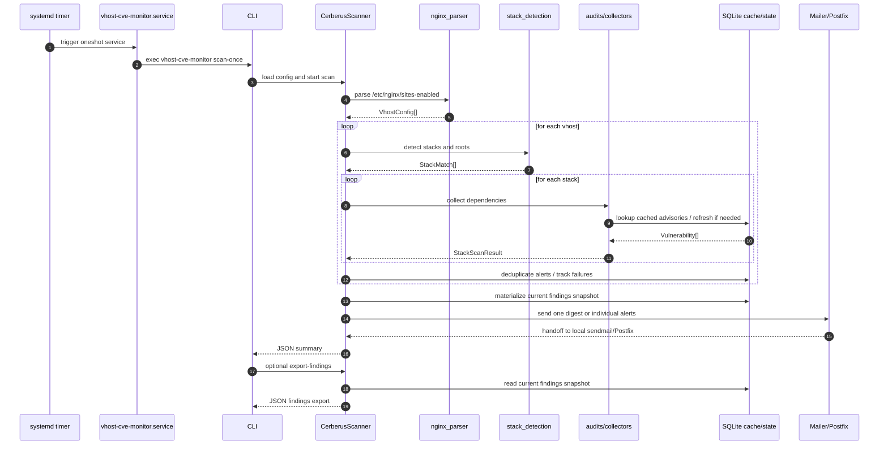
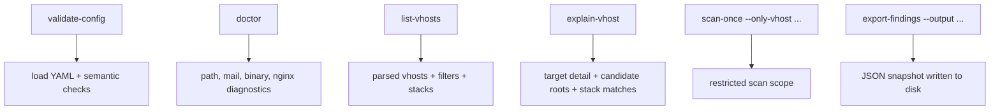

# Cerberus Diagrams

## Sequence Diagram



## Functional Diagram

```mermaid
flowchart TD
    A[nginx vhost files] --> B[nginx_parser]
    B --> C[VhostConfig model]
    C --> D[stack_detection]
    D --> E[Stack matches]
    E --> F[collectors]
    F --> G[Dependency inventory]
    G --> H[audits]
    H --> I[Runtime audit findings]
    G --> J[CVEDatabase]
    J --> K[Local SQLite advisory cache]
    K --> L[Correlated vulnerabilities]
    I --> M[Scanner aggregation]
    L --> M
    M --> N[StateStore deduplication]
    M --> O[Current findings snapshot]
    N --> P[NotificationEvent]
    O --> V[export-findings JSON]
    P --> Q[Mailer]
    Q --> X[sendmail / Postfix / SMTP]

    R[systemd timer] --> S[oneshot service]
    S --> M
    T[/etc/vhost-cve-monitor/config.yml] --> M
    U[/var/lib/vhost-cve-monitor/state.db] --> J
    U --> N
    U --> O
```

## Reading Notes

- The timer is only a trigger. The actual work happens in the oneshot service.
- The scanner aggregates every issue into internal notification objects before applying mail policy.
- SQLite stores advisory cache data, anti-spam state, and the materialized current findings snapshot used by `export-findings`.
- Mail delivery is intentionally delegated to the local MTA instead of implemented directly in Cerberus.

## Admin Inspection Flow



Additional notes:

- `validate-config` is static validation: it checks the loaded configuration structure and obvious semantic conflicts without scanning vhosts.
- `doctor` is operational validation: it checks the local environment assumptions Cerberus depends on at runtime.
- `list-vhosts` and `explain-vhost` expose the nginx parsing, filtering, and stack-detection decisions used by the real scan path.
- `scan-once --only-vhost ...` narrows collection and notification generation to selected targets for focused troubleshooting.
- `export-findings --output ...` uses the same materialized findings snapshot as `export-findings`, but writes it directly to disk for automation.
