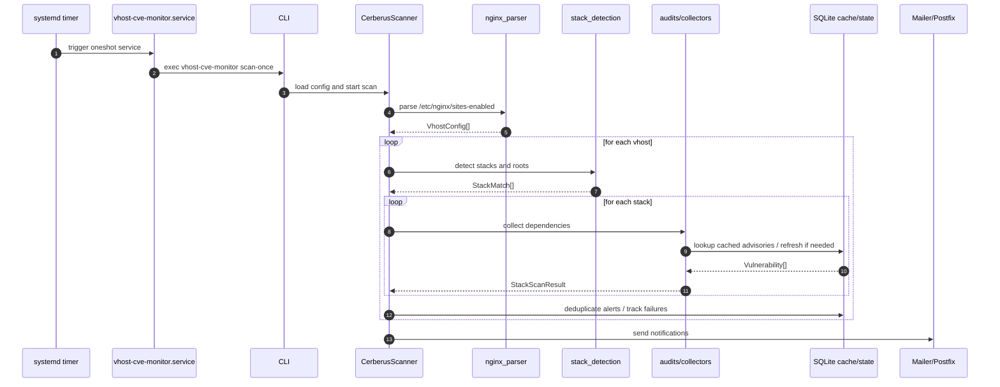
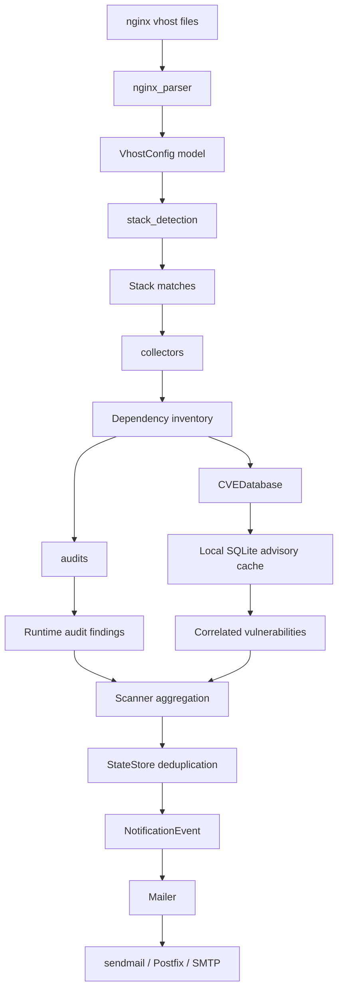

# Cerberus

## Overview

Cerberus is a maintainable Python 3 monitor for Debian servers that inspects nginx vhosts, detects the application stack behind each vhost, runs stack-specific security audits when possible, correlates detected versions with a local SQLite advisory cache, and sends email alerts only for new or materially changed findings.

This export document is intended for editable office formats such as DOCX. It is derived from the repository README and extended with architecture diagrams.

## Architecture Summary

- nginx_parser reads `/etc/nginx/sites-enabled`, resolves useful includes, and extracts server names, roots, and upstream hints.
- stack_detection applies explicit heuristics based on files and upstream names.
- collectors reads package manifests, lockfiles, local virtualenvs, and service version markers.
- audits runs optional ecosystem-native tools such as `npm audit`, `composer audit`, and `pip-audit`.
- cve_db maintains a local SQLite advisory cache fed by targeted OSV queries.
- state_store prevents alert spam by tracking previously sent findings and repeated failures.
- notify delivers alerts through local sendmail, plain SMTP, STARTTLS SMTP, or authenticated SMTPS/SMTP.
- scanner orchestrates the full scan cycle.

## Runtime Flow

1. A systemd timer starts the oneshot service.
2. The CLI loads the configuration and initializes logging.
3. Cerberus parses nginx vhost files.
4. Cerberus detects candidate stacks per vhost.
5. Cerberus collects dependency versions.
6. Cerberus correlates versions with the local CVE cache and optional external audit tools.
7. Cerberus deduplicates notifications.
8. Cerberus sends one digest or individual alerts according to configuration.

## Sequence Diagram

See the repository version in `docs/DIAGRAMS.md`.

## Functional Diagram

See the repository version in `docs/DIAGRAMS.md`.

## Deployment Model

- Recommended scheduler: systemd timers
- Scan service: `vhost-cve-monitor.service`
- Scan timer: `vhost-cve-monitor.timer`
- CVE refresh service: `vhost-cve-monitor-cve-sync.service`
- CVE refresh timer: `vhost-cve-monitor-cve-sync.timer`

## Configuration Split

- Repository default example: `packaging/examples/config.yml`
- Local machine configuration: `/etc/vhost-cve-monitor/config.yml`

The repository file is generic and safe to publish. The `/etc` file contains deployment-specific recipients, sender domains, and tuning values.

## Mail Policy

- Alerts can be sent individually or grouped.
- Current recommended mode: one digest per scan.
- Messages are handed off to local sendmail/Postfix or to a configured SMTP relay.
- SMTP mode supports both STARTTLS and implicit TLS, with optional authentication credentials.
- Prefer `smtp_password_env` over `smtp_password` when storing relay credentials outside the YAML file.
- Delivery success to the final recipient depends on DNS authentication and remote provider policy.
- Digest subjects are intentionally short and operational, keeping only product, highest severity, host scope, and alert count.
- Alerts and digests show fixed versions when upstream advisory data provides them.
- Digest mails keep the differential-alerting model, but now render retained findings by severity block and include advisory summaries when available.
- Recommendations are stack-aware and depend on ecosystem, package manager context, and whether a fixed version is known.
- `test-mail` can simulate explicit severities, categories, and stack-specific vulnerability samples.
- `export-findings` dumps the latest materialized findings snapshot as JSON for external consumers, and initializes that snapshot with a collection-only pass if none exists yet.
- Supported severities: `CRITICAL`, `HIGH`, `MEDIUM`, `WARNING`, `LOW`, `INFO`, `UNKNOWN`
- Supported categories: `test`, `vulnerability`, `scan-failure`, `internal-error`, `digest`
- Example commands:
  - `vhost-cve-monitor --config /etc/vhost-cve-monitor/config.yml test-mail --severity HIGH`
  - `vhost-cve-monitor-testmail HIGH`
  - `vhost-cve-monitor --config /etc/vhost-cve-monitor/config.yml test-mail --severity CRITICAL --category vulnerability`
  - `vhost-cve-monitor --config /etc/vhost-cve-monitor/config.yml test-mail --severity WARNING --category scan-failure`
  - `vhost-cve-monitor --config /etc/vhost-cve-monitor/config.yml test-mail --severity HIGH --category internal-error`
  - `vhost-cve-monitor --config /etc/vhost-cve-monitor/config.yml test-mail --severity MEDIUM --category digest`
  - `vhost-cve-monitor --config /etc/vhost-cve-monitor/config.yml test-mail --category vulnerability --stack nodejs --package lodash --installed-version 4.17.23 --fixed-version ">= 4.17.24" --advisory-id GHSA-35jh-r3h4-6jhm`
  - `vhost-cve-monitor --config /etc/vhost-cve-monitor/config.yml export-findings`
- Unhandled Cerberus execution failures generate a direct `internal-error` mail with a GitHub bug-report hint and are not wrapped into digest mode.
- Live validation note:
  - delivery reached a clean `mail-tester` score after SPF, DKIM, and DMARC were aligned

## Upgrade Existing Installations

If Cerberus is already installed on a machine:

- rerun `sudo sh packaging/scripts/install.sh` from the repository root instead of using global `pip install`
- Cerberus is installed into `/opt/cerberus/.venv`
- admin-facing wrappers are refreshed in `/usr/local/bin/`
- a minimal Debian package is also available through `dpkg-buildpackage -us -uc`, with the same runtime model under `/opt/cerberus/.venv`
- the Debian package relies on `python3-yaml` and a venv created with `--system-site-packages`, so `postinst` does not need to download Python dependencies
- the Debian package ships its example config in `/usr/share/cerberus/config.yml` and only copies it into `/etc/vhost-cve-monitor/config.yml` when no local config exists
- run `systemctl daemon-reload` after changing packaged unit files
- use `systemctl enable --now ...timer` to ensure timers are enabled
- if timers were already active, `daemon-reload` is usually enough unless the unit files changed structurally
- restart the associated `.service` unit, not the `.timer`, when you want to trigger an immediate run
- reload `opendkim` and `postfix` if mail authentication or local MTA integration changed
- the scan timer keeps the materialized findings snapshot current automatically, because each `scan-once` run refreshes the SQLite export state consumed by `export-findings`

Default deployments keep using local sendmail/Postfix. If you keep the example config unchanged, ensure `/usr/sbin/sendmail` exists on the host.
If it does not, Cerberus reports a concise mail-delivery error instead of cascading through an internal Python traceback.

## Known Limits

- nginx parsing is intentionally pragmatic, not a full nginx interpreter.
- Python dependency resolution is strongest when requirements are pinned or a local virtualenv exists.
- Advisory quality depends on upstream OSV coverage and runtime audit tool availability.
- Legacy or proxied deployments can still require stricter vhost-to-backend correlation logic.
- Fixed-version accuracy depends on upstream advisory metadata. Some ecosystems expose only affected ranges, and Cerberus keeps that distinction explicit.

## Repository References

- Internal code walkthrough: `docs/CODE_BREAKDOWN.md`
- Diagrams: `docs/DIAGRAMS.md`
- Main repository README: `README.md`
